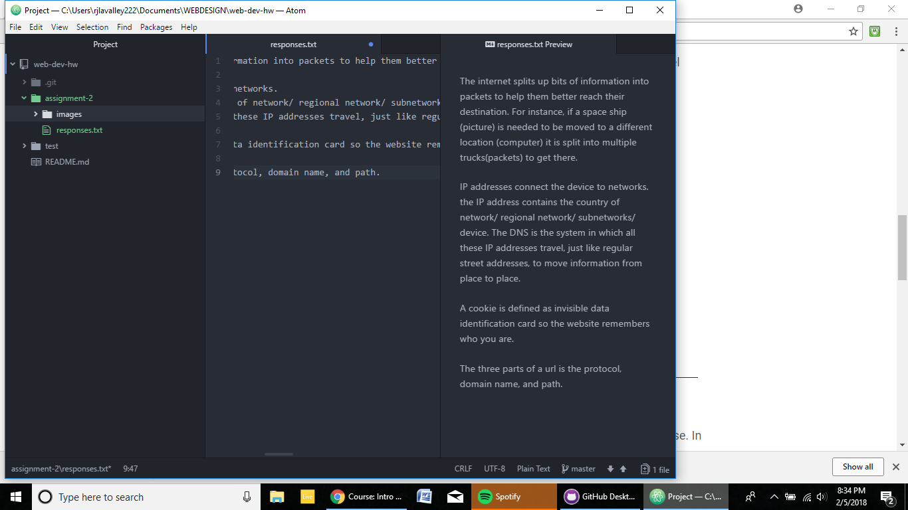

# Assignment 2
Version Control System helps a user make changes to a file and track the changes overtime. You can tell whether or not something will work without having to create a bunch of save as files, it either works or doesn't. We use it because it makes collaboration easier and its also easier to share changes and progress.

[Responses](./responses.txt)

I think the hardest part for me was trying to follow all the steps and missing just little bits of information that were hindering my progress. Other than that, if you are careful, and follow all directions, you can reach the end in a success. Remembering the markdowns is probably the hardest and most time consuming in my process so far.
